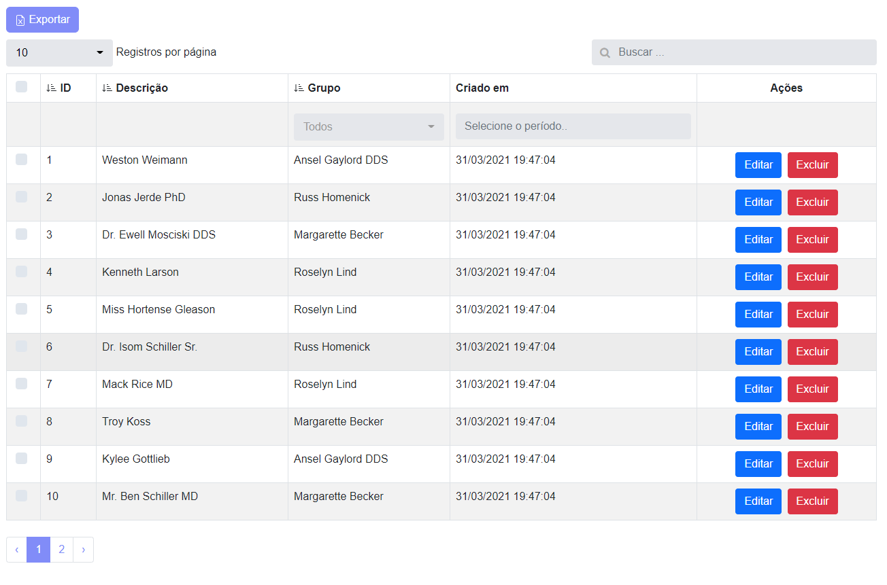

# Livewire DataTables

## What is Livewire DataTables?

Livewire DataTables is a component for [Laravel Livewire](https://laravel-livewire.com) used to generate dynamic tables for your Laravel Entities or collections.

Out of the box Livewire DataTables component provides many features, such as:

- Searching & Filters
- Column Sorting
- Pagination
- Action checkboxes
- Action buttons
- Link on table cell
- Data Export to CSV/Excel.

The component works with Bootstrap or Tailwind.

Bootstrap version


Tailwind version


Exported example with selected data


[View more examples!](examples)

---
# Requirements

- [Laravel 8x](https://laravel.com/docs/8.x/installation)
- [Livewire 2x](https://laravel-livewire.com)
- Tailwind or bootstrap:
  - [Install Tailwindcss](https://tailwindcss.com/docs/guides/laravel)
  - [Install Bootstrap 5](https://getbootstrap.com/docs/5.0/getting-started/introduction/)

# Get started!

## Installation

For the instalation guide we will create a `ProductTable` to list  products of a `Product` Model.

### 1. Via composer:

To install via composer, run the following command:

```bash
  composer require luanfreitasdev/livewire-datatable
```

### 2. Add DataTableServiceProvider to your Providers list.

Open the file `config/app.php` and add the line bellow after your other providers:

```php
  LuanFreitasDev\LivewireDataTables\Providers\DataTableServiceProvider::class,
```

Your code should look similar to this:


```php
<?php

 //...
 
    'providers' => [
        //...
        LuanFreitasDev\LivewireDataTables\Providers\DataTableServiceProvider::class,       
    ];
```

### 3. [OPTIONAL] Publish files

This step is option, you may skip it in case you don't need to customize Livewire DataTables.

You may publish the Livewire DataTables configuration, views and language files with the following commands:

Config file:

```bash
    php artisan vendor:publish --tag=livewire-datatable-config
```

Views:
```bash
    php artisan vendor:publish --tag=datatable-views
```

Language files:
```bash
    php artisan vendor:publish --tag=livewire-datatable-lang
```

### 4. Be sure to setup the Livewire policies. 

You can read more about this at the official [Livewire documentation](https://laravel-livewire.com/docs/2.x/quickstart)
.

```html
    @livewireStyle and @livewireScripts
```

---
### 5.  Creating a Table Component

To create a Table Component for an entity use the following Artisan command.

Make sure to use "" around your `--model` option.


```bash
    php artisan make:table --name=ProductTable --model="App\Models\Product"
```

If everything was succesfull, you will find your new table component inside the `app/Http/Livewire` folder.


#### Options

| Option | Description | Example | 
|----|----|----|
|**--name**| Model name | ```--name=ProductTable``` |
|**--model**| Full model path | ```--model="App\Models\Product"``` |
|**--publish**| Publish stubs file into the path 'stubs' | ```--publish``` |
|**--template**| Sometimes you can use ready-made templates for creating different types of tables | ```php artisan make:table --template=stubs/table.sub or php artisan make:table --template=stubs/table_with_buttons.sub``` |


### 6.  Using your Table Component.

The `ProductTable` component can be included in any view.

There are two ways to do that. Both work in the same way:


```html
    <livewire:product-table/>
```

or

```html
  @livewire('product-table')
```


---


# Configuring & Customizing your Table Component

_::: wip :::_

You can configure and customize your table component to adjust it to your needs.

Verify the following methodos:

- `setUp`, 
- `dataSource`, 
- `columns` 
- `actions`

Example:

```php
    class ProductTable extends DataTableComponent
    {
        use ActionButton;

        public function setUp()
        {
            $this->showCheckBox()->showPerPage()->showSearchInput();
        }
    
        public function dataSource(): array
        {
            $model = Product::query()->with('group')->get();
            return DataTable::eloquent($model)
                ->addColumn('id', function(Product $model) {
                    return $model->id;
                })
                ->addColumn('name', function(Product $model) {
                    return $model->name;
                })
                ->addColumn('group_id', function(Product $model) {
                    return $model->group_id;
                })
                ->addColumn('group_name', function(Product $model) {
                    return $model->group->name;
                })
                ->addColumn('created_at', function(Product $model) {
                    return $model->created_at;
                })
                ->addColumn('created_at_format', function(Product $model) {
                    return Carbon::parse($model->created_at)->format('d/m/Y H:i:s');
                })
                ->make();
        }
    
        public function columns(): array
        {
            return [
                Column::add()
                    ->title('ID')
                    ->field('id')
                    ->searchable()
                    ->sortable()
                    ->make(),
    
                Column::add()
                    ->title('Descrição')
                    ->field('name')
                    ->searchable()
                    ->sortable()
                    ->make(),
    
                Column::add()
                    ->title('GrupoID')
                    ->field('group_id')
                    ->hidden()
                    ->make(),
    
                Column::add()
                    ->title('Grupo')
                    ->field('group_name')
                    ->makeInputSelect(Group::all(), 'name', 'group_id', ['live_search' => true ,'class' => ''])
                    ->searchable()
                    ->sortable()
                    ->make(),
    
                Column::add()
                    ->title('Criado em')
                    ->field('created_at')
                    ->hidden()
                    ->make(),
    
                Column::add()
                    ->title('Criado em')
                    ->field('created_at_format')
                    ->makeInputDatePicker('created_at')
                    ->searchable()
                    ->make(),
            ];
        }
    
        public function actions(): array
        {
            return [
                Button::add('edit')
                    ->caption('Editar')
                    ->class('btn btn-primary')
                    ->route('user.edit', ['id' => 'id'])
                    ->make(),
    
                Button::add('delete')
                    ->caption('Excluir')
                    ->class('btn btn-danger')
                    ->route('user.delete', ['id' => 'id'])
                    ->make(),
            ];
        }
    }
```

## Column Methods

_::: wip :::_

| Method | Arguments | Result | Example |
|----|----|----|----|
|**add**| |Add new column |```Column::add()```|
|**title**| *String* $title |Column title representing a field |```add()->title('Name')```|
|**field**| *String* $field | Field name| ```->field('name')```|
|**searchable**| |Includes the column in the global search | ```->searchable()``` |
|**sortable**| |Includes column in the sortable list | ```->sortable()``` |
|**headerAttribute**|[*String* $class default: ''], [*String* $style default: '']|Add the class and style elements to the column header|```->headerAttribute('text-center', 'color:red')```|
|**bodyAttribute**|[*String* $class default: ''], [*String* $style default: '']|Add the column lines the class and style elements|```->bodyAttribute('text-center', 'color:red')```|
|**html**| |When the field has any changes within the scope using Collection|```->html()```|
|**visibleInExport**| |When true it will be invisible in the table and will show the column in the exported file|```->visibleInExport(true)```|
|**hidden**| |hides the column in the table|```->hidden()```|
|**filterDateBetween**| [*String* $class default: 'col-3'] |Include a specific field on the page to filter between the specific date in the column|```Column::add()->filterDateBetween()```|
|**makeInputSelect**| [*Array* $data_source, *String* $display_field, *String* $relation_id, *Array* $settings] |Include a specific field on the page to filter a hasOne relation in the column|```Column::add()->makeInputSelect(Group::all(), 'name', 'group_id', ['live_search' => true ,'class' => ''])```|
---


## Action Methods

_::: wip :::_


### Route
 `->route(string, array)`

string = route name
array = route parameters, for example route resource: `Route::resource('products', 'ProductController');`

    array example:
        [
            'id' => 'id'
        ] 
    represents:
        [
            'parameter_name' => 'field' (to get value from this column) 
        ]
    in this case we will have:
        [
            'id' => 1
        ]


---

### Filters

To use a filter, you must declare the ```@datatableFilter``` directive before </body>

---
## Support

If you need any support, please check our [Issues](https://github.com/luanfreitasdev/livewire-datatable/issues). You can ask questions or report problems there.


## Credits

- [Contributions](https://github.com/luanfreitasdev/livewire-datatable/pulls)